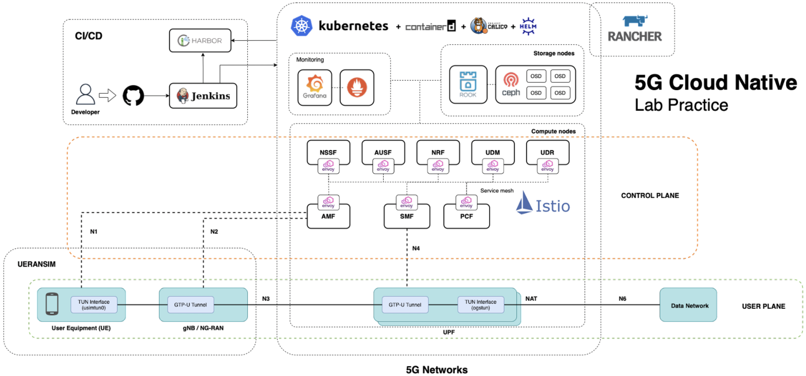

# The 6th Month Research of Cloud Native RG
```
Research about implementation Core 5GS Network on Cloud Native
```

## General Diagram Flow


## Environment
```
Kubernetes
Helm
```

## Deployment Open5GS
```
Deploy Component Open5Gs with Helm
```
```
helm repo add adaptivenetlab https://adaptivenetlab.github.io/charts/
helm repo update
helm search repo adaptivenetlab
```
```
kubectl create ns open5gs
helm install open5gs adaptivenetlab/open5gs -n open5gs
helm install ueransim adaptivenetlab/ueransim -n open5gs
```
```
Ueransim is not recommended to deploy with helm template, cause we must adjust AMF IP POD on GNB manifest.
You can use manual helm installation mode, with :

git clone https://github.com/Gradiant/openverso-charts.git
cd openverso-charts/charts/ueransim
sudo nano values.yaml
---
mcc: '208'
mnc: '93'
tac: '7'
---

sudo nano resources/gnb.yaml
"change AMF POD IP on address amfConfigs section with your AMF POD IP {kubectl get pod -o wide -n open5gs | grep amf}" , then

helm -n open5gs install -f values.yaml ueransim ./
```

## Component Description
```
MME - Mobility Management Entity
HSS - Home Subscriber Server
PCRF - Policy and Charging Rules Function
SGWC - Serving Gateway Control Plane
SGWU - Serving Gateway User Plane
PGWC/SMF - Packet Gateway Control Plane / (component contained in Open5GS SMF)
PGWU/UPF - Packet Gateway User Plane / (component contained in Open5GS UPF)
AMF - Access and Mobility Management Function
SMF - Session Management Function
UPF - User Plane Function
AUSF - Authentication Server Function
NRF - NF Repository Function
UDM - Unified Data Management
UDR - Unified Data Repository
PCF - Policy and Charging Function
NSSF - Network Slice Selection Function
BSF - Binding Support Function
```

## Reference 
```
https://github.com/open5gs/open5gs
https://assyafii.com/docs/5g-cloud-native-simulation-with-open5gs/
https://github.com/Gradiant/openverso-charts
https://bitbucket.org/gilangvperdana/opensource-5g-core-service-mesh
```